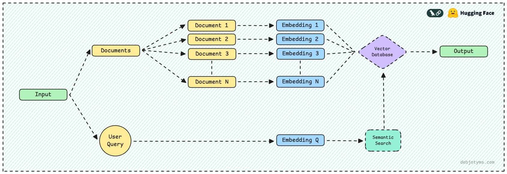

# Semantic Document Finder

Semantic Document Finder is a lightweight and efficient semantic search application built using **LangChain** and **HuggingFace Transformers**. This tool helps users find the most relevant document from a collection of text files based on the **contextual similarity** of an input query, rather than relying solely on keyword matching.

## Table of Contents

- [Overview](#overview)
- [Workflow Diagram](#workflow-diagram)
- [Features](#features)
- [Live Demo](#live-demo)
- [How It Works](#how-it-works)
- [Installation and Setup](#installation-and-setup)
- [Usage](#usage)
- [Dependencies](#dependencies)
- [Contributing](#contributing)
- [License](#license)

---

## Overview

The Semantic Document Finder leverages state-of-the-art natural language processing (NLP) techniques to perform semantic search. Instead of traditional keyword-based search, it uses **embeddings** generated by the **sentence-transformers/all-MiniLM-L6-v2** model to compute the cosine similarity between the query and the documents. This ensures that the search results are contextually relevant, even if the exact keywords are not present in the documents.

This project is ideal for scenarios where you need to quickly retrieve the most relevant document from a collection of unstructured text data.

---

## Workflow Diagram

Below is the workflow diagram illustrating how the application processes queries and retrieves relevant documents:



The diagram was created using [Excalidraw](https://excalidraw.com/).

---

## Features

- **Semantic Search**: Finds the most relevant document based on contextual similarity, not just keyword matching.
- **Easy Integration**: Designed to work with plain `.txt` files stored in a folder.
- **Scalable**: Can handle multiple documents efficiently using embeddings.
- **User-Friendly**: Simple command-line interface for interaction.
- **Customizable**: Easily extendable to support additional file formats or embedding models.

---

## Live Demo

Here's a live demo of the application in action:


---

## How It Works

1. **Document Loading**: The application loads all `.txt` files from the `documents` folder into memory.
2. **Embedding Generation**: Each document's content and the user's query are converted into dense vector representations (embeddings) using the `all-MiniLM-L6-v2` model.
3. **Cosine Similarity Calculation**: The cosine similarity between the query embedding and each document embedding is computed to determine relevance.
4. **Result Retrieval**: The document with the highest similarity score is returned as the most relevant result.

---

## Installation and Setup

### Prerequisites

- Python 3.8 or higher
- Git
- A folder named `documents` containing `.txt` files (or create one during runtime)

### Steps

1. Clone the repository:
   ```bash
   git clone https://github.com/your-username/langchain-semantic-finder.git
   cd langchain-semantic-finder
   ```

2. Install the required dependencies:
   ```bash
   pip install -r requirements.txt
   ```

3. Create a folder named `documents` in the root directory and add your `.txt` files to it:
   ```bash
   mkdir documents
   ```

4. Run the application:
   ```bash
   python main.py
   ```

---

## Usage

1. Start the application by running `python main.py`.
2. Enter your query when prompted.
3. The application will display:
   - The name of the most relevant document.
   - The similarity score (between 0 and 1).
   - The full content of the document.
---

## Dependencies

- **Python Libraries**:
  - `langchain-huggingface`: For generating embeddings using HuggingFace models.
  - `dotenv`: For managing environment variables (if needed in future extensions).
  - `numpy`: For numerical operations.
  - `scikit-learn`: For calculating cosine similarity.

- **Model**:
  - `sentence-transformers/all-MiniLM-L6-v2`: A lightweight yet powerful sentence embedding model.

Install all dependencies using:
```bash
pip install -r requirements.txt
```

---

## Contributing

We welcome contributions to improve this project! Here's how you can contribute:

1. Fork the repository.
2. Create a new branch for your feature or bug fix:
   ```bash
   git checkout -b feature-name
   ```
3. Commit your changes:
   ```bash
   git commit -m "Add feature or fix"
   ```
4. Push to your branch:
   ```bash
   git push origin feature-name
   ```
5. Open a pull request with a detailed description of your changes.

---

## License

This project is licensed under the **MIT License**. See the [LICENSE](LICENSE) file for details.

---

## Acknowledgments

- **LangChain**: For providing a robust framework for building NLP applications.
- **HuggingFace**: For their excellent transformer models and embedding tools.
- **Excalidraw**: For enabling easy creation of workflow diagrams.

---

Feel free to reach out with any questions, suggestions, or feedback!