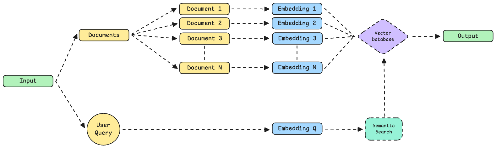

# langchain-semantic-finder
This is a simple semantic search application built with LangChain. It helps users find the most relevant document from a set of texts based on the context of an input query, not just keywords.
## Workflow Diagram

Used https://excalidraw.com/ to draw the workflow diagram.

